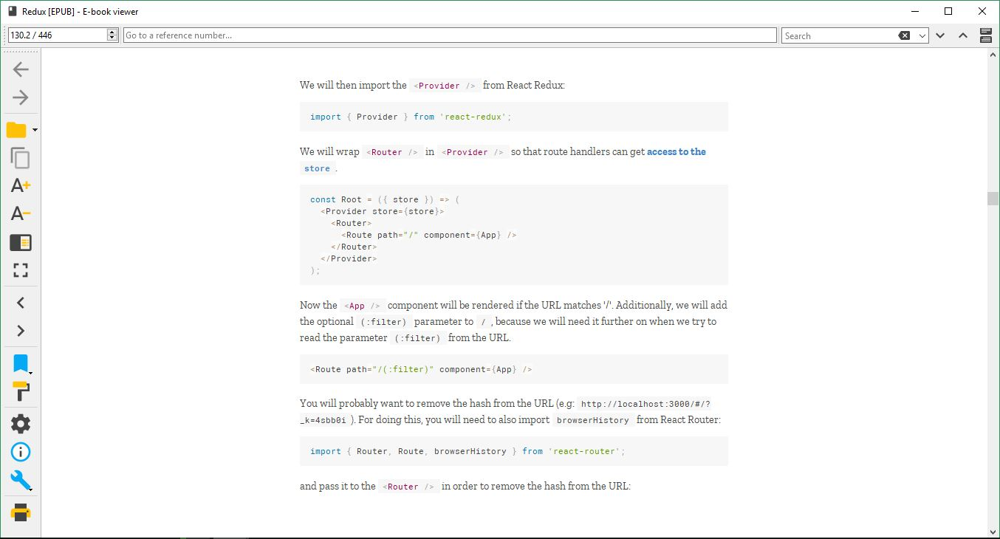

# formstreak: Calibre customizations: Vue

A User stylesheet for [Calibre e-book viewer](https://calibre-ebook.com/) inspired by the excellent [Vue.js Guide](https://vuejs.org/v2/guide/). 

### Usage

1. Install [Lato](https://fonts.google.com/specimen/Lato?selection.family=Lato:400,400i,700,700i) and [Roboto Mono](https://fonts.google.com/specimen/Roboto+Mono?selection.family=Roboto+Mono:400,400i,700,700i) fonts.
2. Copy the contents of [vue.css](https://github.com/Microflash/ExCalibre/blob/master/vue/vue.css) file.
3. Open **Calibre E-book Viewer** > **Preferences** > **User stylesheet** tab and paste the content.

Changes will be reflected immediately.
