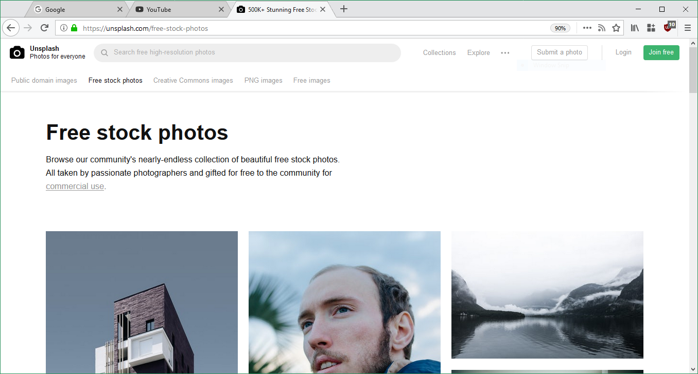

# formstreak / Firefox Quantum customizations

A custom userChrome featuring:

- Chrome-style tabs
- Minimalistic toolbar, findbar and tabbar 

### Usage

Instructions [here](https://www.reddit.com/r/FirefoxCSS/comments/73dvty/tutorial_how_to_create_and_livedebug_userchromecss/)

#### Compatibility

Works with Firefox Quantum. Please raise a Github issue in the repo or (better) lodge it on [r/FirefoxCSS](https://www.reddit.com/r/FirefoxCSS/)

#### Known Issues

- Works best in Normal density
- Not tested on Linux or Mac
- Hover on tabs reveals previous tabs border
- Not tested with dark mode