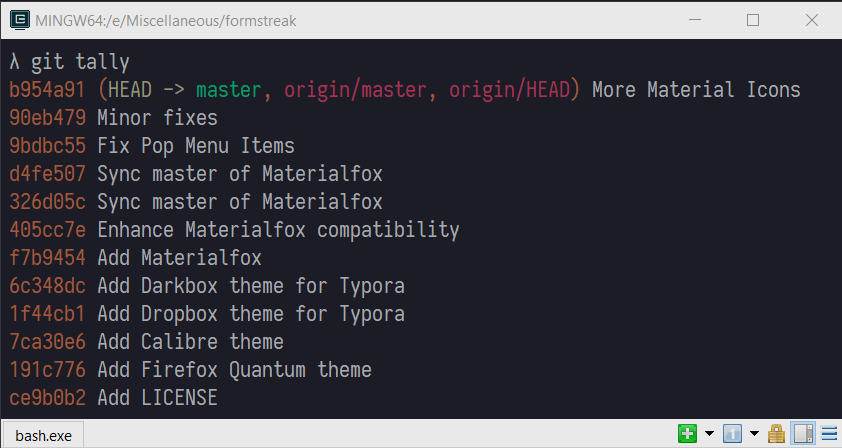

# formstreak: Horizon

A [Horizon](https://horizontheme.com)-inspired color scheme for ConEmu.



## Installation

Start by adding a `Colors` key in your `ConEmu.xml` file. 

- Open *Settings > Features > Colors*.
- Create a new custom color theme with a name `Horizon`.
- Press `Save` button.

This will generate a `Colors` key in the `ConEmu.xml` config file.

Open `ConEmu.xml` file and copy and paste the content of [horizon.xml](./horizon.xml) as suggested by the comment. Update the pallette number `<key name="PaletteX"` if required. Also, increment the value of `Count` key after the `Colors` key; the `Count` should be the total number of palettes configured under `Colors` key.

```xml
<?xml version="1.0" encoding="utf-8"?>
<key name="Software">
  <key name="ConEmu">
    <key name=".Vanilla" modified="2019-10-06 11:04:36" build="180626">
      <!-- Other ConEmu configuration -->
      <key name="Colors" modified="2019-09-30 22:05:37" build="180626">
        <value name="Count" type="long" data="1"/>
        <!-- Paste horizon.xml content here -->
        <!-- Other palettes -->
      </key>
    </key>
  </key>
</key>
```

The following example shows `Colors` key when only `Horizon` is installed.

```xml
<key name="Colors" modified="2019-09-30 22:05:37" build="180626">
  <value name="Count" type="long" data="2"/>
  <key name="Palette1" modified="2019-09-30 22:17:45" build="180626">
    <value name="Name" type="string" data="Horizon"/>
    <value name="TextColorIdx" type="hex" data="10"/>
    <value name="BackColorIdx" type="hex" data="10"/>
    <value name="PopTextColorIdx" type="hex" data="10"/>
    <value name="PopBackColorIdx" type="hex" data="10"/>
    <value name="ColorTable00" type="dword" data="00302523"/>
    <value name="ColorTable01" type="dword" data="00a29820"/>
    <value name="ColorTable02" type="dword" data="006f43e9"/>
    <value name="ColorTable03" type="dword" data="0096d727"/>
    <value name="ColorTable04" type="dword" data="0064d2ea"/>
    <value name="ColorTable05" type="dword" data="00db77b8"/>
    <value name="ColorTable06" type="dword" data="0095b7fa"/>
    <value name="ColorTable07" type="dword" data="00f2edea"/>
    <value name="ColorTable08" type="dword" data="006f5551"/>
    <value name="ColorTable09" type="dword" data="00c2bf21"/>
    <value name="ColorTable10" type="dword" data="008cda07"/>
    <value name="ColorTable11" type="dword" data="00e6dd79"/>
    <value name="ColorTable12" type="dword" data="005c3ef4"/>
    <value name="ColorTable13" type="dword" data="00b93189"/>
    <value name="ColorTable14" type="dword" data="001e66f6"/>
    <value name="ColorTable15" type="dword" data="00ddebfd"/>
  </key>
</key>
```

## Activation

Open *Settings > Features > Colors*, select `Horizon` from the *Schemes* dropdown and click `Save settings` button.